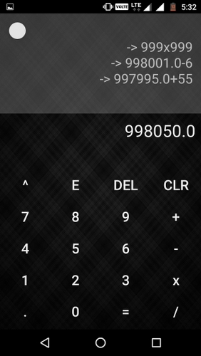

# CalculatorFx - Dark UI Android Calculator
 
<a href="https://play.google.com/store/apps/details?id=com.abhishekstechlab.calculatorfx&hl=en"></a>

## To use source code : 
1. Clone Repository <br>
```git clone https://github.com/ft-abhishekgupta/android-calculator```
1. Open Repository in Android Studio
1. Sync Project and Install Required Dependencies
1. Build and Run Project.

 
## Functions Available -

* Fractional number support
* Addition
* Subtraction
* Multiplication
* Division
* Power
* Exponent
* Radian, PI, e values
* Square root
* Sin
* Cos
* Tan
* Sin Inverse
* Cos Inverse
* Tan Inverse
* Log
* Ln
* Factorial

## Features -
★ View History
★ Store and Recall Feature
★ Snappy response
★ Haptic Feedback
★ Button Animation
★ Dark Theme based UI

**Rate and Share the App if you like it.**
## Screenshots


